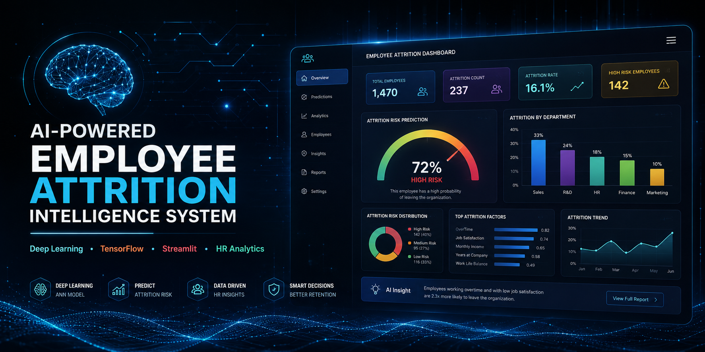
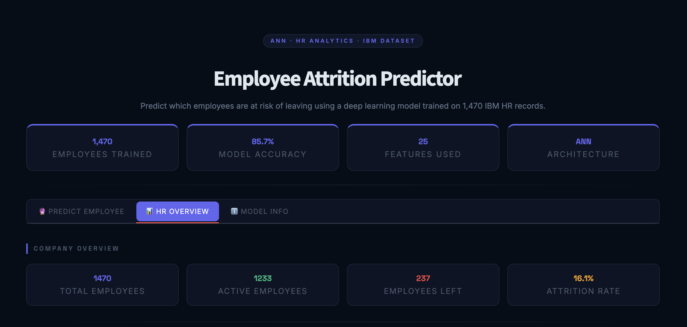
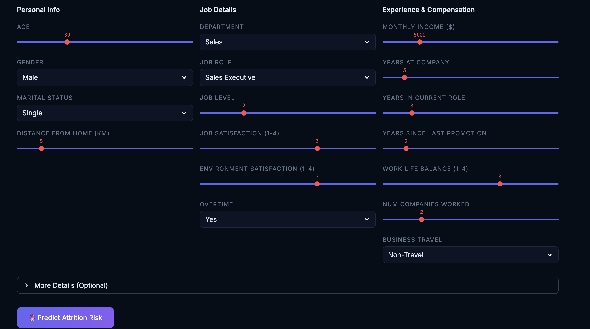
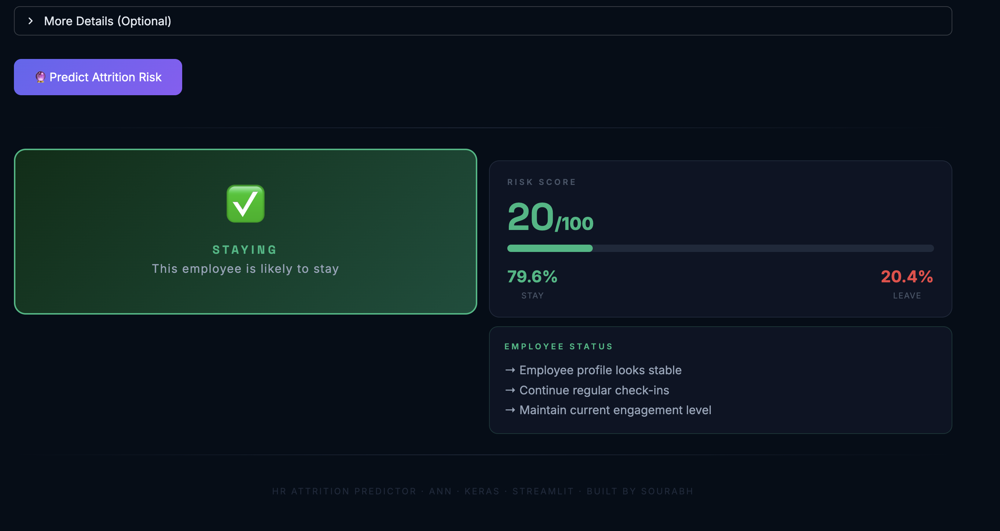
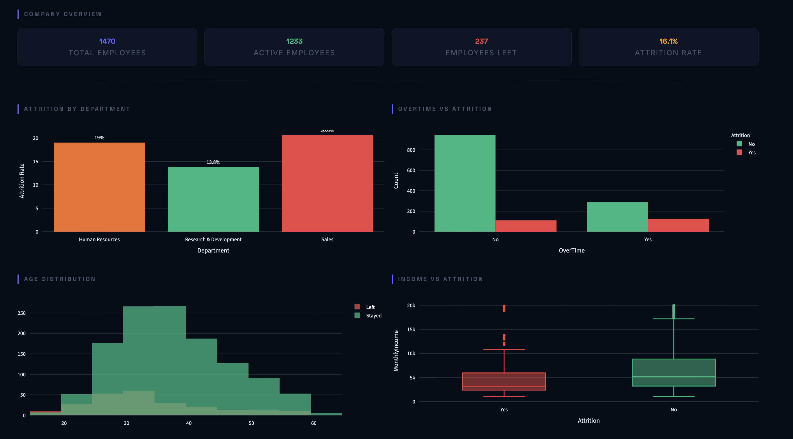

<p align="center">
  
</p>

<h1 align="center">🤖 AI-Powered Employee Attrition Intelligence System</h1>

<p align="center">
Predict employee attrition using Deep Learning with an interactive Streamlit dashboard
</p>

<p align="center">


</p>

<p align="center">

<a href="https://ai-powered-employee-attrition.onrender.com/">

</a>

<a href="https://github.com/sourabh9098/AI-Powered-Employee-Attrition-Intelligence-System">

</a>

</p>

---

# 📖 Overview

Employee attrition is one of the biggest challenges organizations face, leading to increased hiring costs, reduced productivity, and knowledge loss.

This project uses an **Artificial Neural Network (ANN)** built with **TensorFlow/Keras** to predict whether an employee is likely to leave the organization based on HR-related attributes.

The project demonstrates the complete Machine Learning workflow—from preprocessing and feature engineering to model deployment through an interactive Streamlit application.

---

# 🚀 Live Application

### 🌐 Live Demo

https://ai-powered-employee-attrition.onrender.com/

### 💻 GitHub Repository

https://github.com/sourabh9098/AI-Powered-Employee-Attrition-Intelligence-System

### Linkedin 

https://www.linkedin.com/posts/sourabh9098_machinelearning-deeplearning-artificialintelligence-ugcPost-7486896093188902912-KzQ-/?utm_source=share&utm_medium=member_desktop&rcm=ACoAADu3L_0B9SW06fHwj_626Uq5NBBksYtP2AM

---

# ✨ Features

- 🤖 Employee Attrition Prediction using Deep Learning
- 📊 Employee Risk Score
- 📈 Prediction Probability
- 🎯 Interactive Streamlit Dashboard
- ⚡ Real Time Prediction
- 📉 HR Analytics Visualization
- 🧹 Data Preprocessing Pipeline
- 💾 Pre-trained ANN Model
- 🌐 Deployed Web Application

---

# 📷 Dashboard Preview

## Home Dashboard

<p align="center">

</p>

---

## Prediction Interface

<p align="center">

</p>

---

## Prediction Result

<p align="center">

</p>

---

## Analytics Dashboard

<p align="center">

</p>

---

# 🧠 Model Architecture

```
Input Features (25)

        │

Dense Layer (128)

        │

Batch Normalization

        │

Dropout (0.30)

        │

Dense Layer (64)

        │

Batch Normalization

        │

Dropout (0.20)

        │

Dense Layer (32)

        │

Dropout (0.10)

        │

Output Layer (Sigmoid)
```

---

# 🔄 Project Workflow

```
HR Dataset
      │
      ▼
Data Cleaning
      │
      ▼
Feature Engineering
      │
      ▼
Encoding
      │
      ▼
Feature Scaling
      │
      ▼
Artificial Neural Network
      │
      ▼
Model Evaluation
      │
      ▼
Model Saving
      │
      ▼
Streamlit Deployment
```

---

# 🛠 Tech Stack

| Category | Technologies |
|-----------|--------------|
| Programming | Python |
| Deep Learning | TensorFlow, Keras |
| Machine Learning | Scikit-Learn |
| Data Processing | Pandas, NumPy |
| Visualization | Plotly, Matplotlib |
| Deployment | Streamlit, Render |
| Model Storage | Joblib, Keras |

---

# 📂 Project Structure

```
AI-Powered-Employee-Attrition-Intelligence-System

│

├── app.py

├── employee_attrition_ann.keras

├── scaler.pkl

├── selected_features.pkl

├── WA_Fn-UseC_-HR-Employee-Attrition.csv

├── requirements.txt

├── images/

│   ├── banner.png

│   ├── dashboard.png

│   ├── prediction.png

│   ├── result.png

│   └── analytics.png

└── README.md
```

---

# 🎯 Future Improvements

- Explainable AI using SHAP
- Batch Prediction
- REST API Integration
- Docker Support
- Cloud Database
- MLOps Pipeline
- Model Monitoring
- CI/CD Automation

---

# 👨‍💻 About Me

**Sourabh Vishwakarma**

Aspiring AI Engineer | Machine Learning Enthusiast | Deep Learning Learner

### GitHub

https://github.com/sourabh9098

### LinkedIn

https://www.linkedin.com/in/sourabh9098

---

# Support

If you found this project useful , consider giving it a⭐ on GitHub


<p align="center">

Made with ❤️ using Python, TensorFlow and Streamlit

</p>
